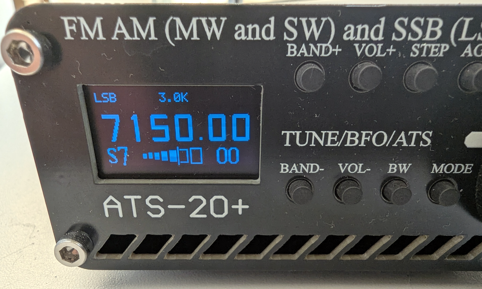
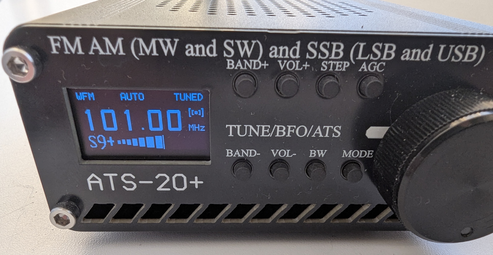

# ATS-20 Plus NG (ats20plus_ng)

Next-generation firmware for **ATS-20 / ATS-20+** receivers (**ATmega328** + **Si4735**).

**Version:** 2.0B  
**Repository:** https://github.com/minerdear0-jpg/ats20plus_ng  
**Download (.hex):** https://github.com/minerdear0-jpg/ats20plus_ng/releases/tag/v2.0B

Lineage: **Goshante ATS_EX v1.18** (PU2CLR) → hardware services from **diqezit** → new OLED UI and radio core polish for **328PB / 32 KB flash**.

## UI (main screen)

Firmware **2.0B** on **ATS-20+** hardware.



*SSB (LSB), 7150 kHz — Icom-style VFO, idle MODE/BW (Karat), 7-cell S-meter wall, GOST S-label, SNR (dB) in aux slot*



*WFM, 101 MHz — TUNED latch, stereo pictogram, S9+, AUTO bandwidth*

## User guide (Russian)

**[docs/USER_GUIDE.ru.md](docs/USER_GUIDE.ru.md)** — full manual: controls, overlays, settings cave, S-meter, FM FREQOFF, differences vs Goshante v1.18 and diqezit.

## Build

```bash
./build.sh uno              # hex → build/uno/ATS_EX.ino.hex (not in git)
./build.sh --fast uno
./build.sh --upload uno       # CH340 / ttyUSB, Optiboot 328P @ 115200
```

Target: **Arduino Uno FQBN** (32256 B flash). Silicon is often **ATmega328PB** (ISP `-p m328pb`).

## Flashing

**Required programmer:** [**USBasp NG**](https://github.com/minerdear0-jpg/usbasp_ng) — ISP adapter for ATmega328(P/PB). Needed for first-time flash and for the full image (app + bootloader).

| Release file | Tool | When |
|--------------|------|------|
| `ats20plus_ng_v2.0B_usb.hex` | USB-UART (CH340) + AVRDUDESS / avrdude | Bootloader already on the receiver; routine updates |
| `ats20plus_ng_v2.0B_with_bootloader.hex` | **USBasp NG** (ISP) | Blank chip, bricked bootloader, or full reflash |

After first flash: hold **encoder button** at power-on for **EEPROM RESET**.

## vs Goshante ATS_EX v1.18 (summary)

- **UI:** Icom-style VFO, overlay chips, 7-cell S-meter wall, GOST label, aux SNR / FREQOFF cue, plain Karat idle labels.
- **Settings:** one-line **MODE long** cave — multi-page **BAND− menu removed**.
- **RDS:** compiled out (`USE_RDS 0`) to save flash.
- **Radio path:** deferred SI4735 tune, 100 kHz I2C idle / 400 kHz on frequency commit, **RADIO ERR** + retry.
- **From diqezit:** ANB, SQL, display auto-off (DIS), CW pitch (CWP).

Details: [docs/USER_GUIDE.ru.md](docs/USER_GUIDE.ru.md).

## Flash budget

~**32162 / 32256** B, SRAM ~**1087 / 2048**. Treat every UI pixel as an `avr-size` experiment.

## Credits

- **Goshante** — ATS_EX v1.18 baseline UI/controls concept  
- **PU2CLR** — Si4735 library lineage  
- **diqezit** — ANB/SQL and hardware-oriented fixes  
- **esp32-si4732/ats-mini** — architectural ideas (not a port)
